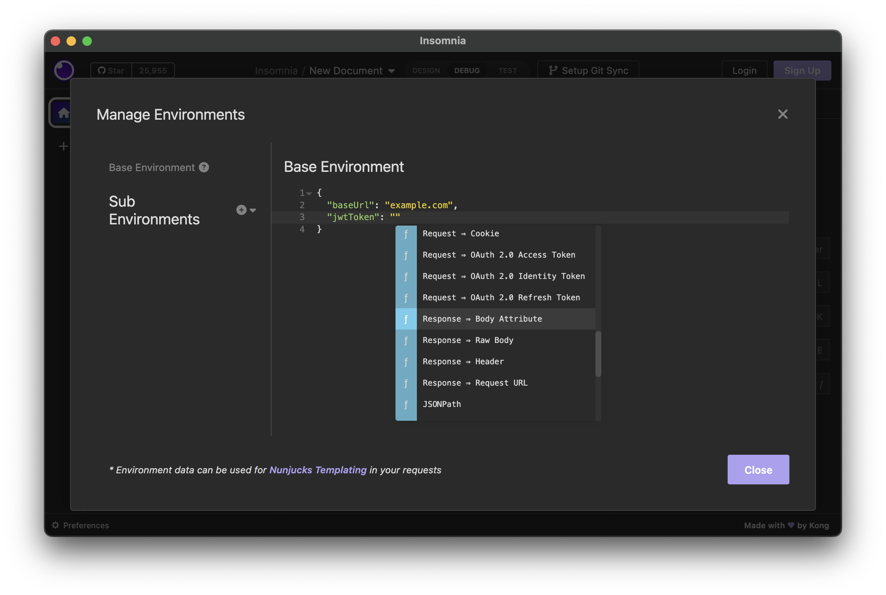
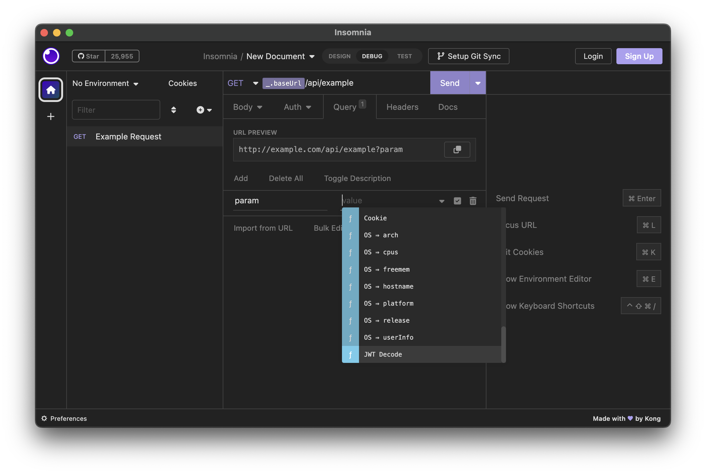
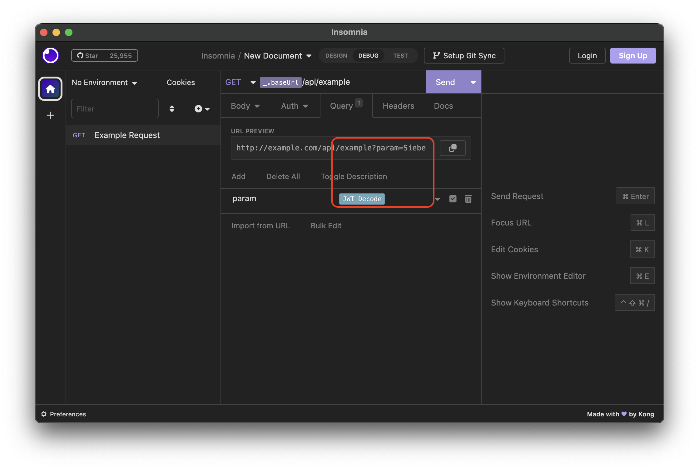

#  JWT (JSON Web Token) decoder for Insomnia REST Client

This is a plugin for the [Insomnia REST client](https://insomnia.rest/) to decode the **Header** or **Payload** part of a [JWT (JSON WebToken)](https://jwt.io/), return the value of a claim in that part and use it as a dynamic variable.

**This plugin is not for encoding,constructing,validating, ... or other usages besides decoding JWT tokens.**

## Decoding Usage

At the time of writing (Insomnia 2022.7.1), it is not possible to reference the JWT token from a body attribute of another request directly in the JWT Decode plugin. However, we can add the JWT token as an environment variable and reference that.

# License

[MIT](LICENSE)
